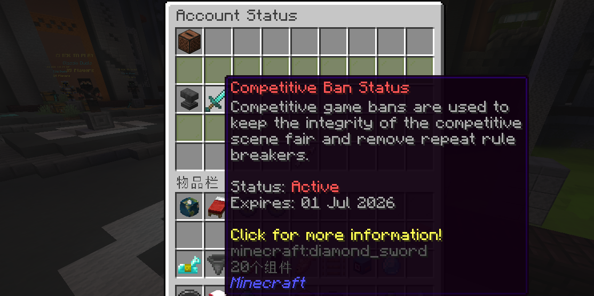
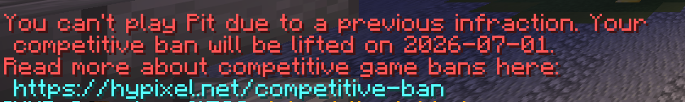
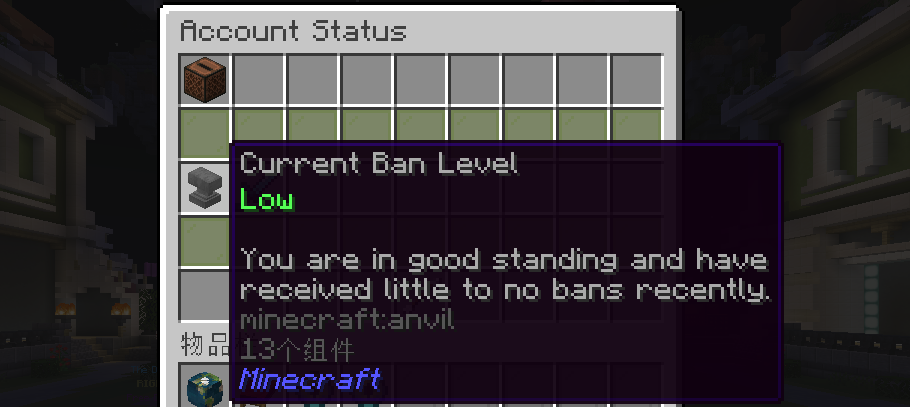
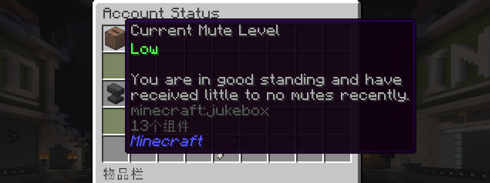

# 深入解析Hypixel所有处罚类型
---
:::important 观前提醒
请将微软账号二次验证（2FA）打开，防止被刷黑卡，被盗号申诉不会解封
被盗Token后请立即去xbox官网打开禁止进入多人游戏，并一直挤号来降低损失
关于文章内容的错误您可以前往Github页面提交issue或直接联系我
:::

**目录：**

1. [前言及观前科普](#starter)
2. [封禁（除Skyblock）相关](#ban)
3. [竞技类游戏处罚与账号状态](#game-punishments)
4. [Skyblock社区的处罚](#skb)
5. [禁言处罚](#mute)
6. [关于工单申诉(support.hypixel.net)的相关事宜](#ticket)
7. [常见问题答疑](#faq)
8. 致谢

>前言：在很多视频的评论区下面都能看到观众对Hypixel封禁不正确的科普内容，因此根据自己对Hypixel禁令的研究撰写了此文，以用于科普。当然内容也可能有不正确的地方，如有错误还请大家在评论区指出，我会进行更改，谢谢！

观前先科普一下一些知识性的东西：
<ul>
<li>黑历史指被ban后会导致竞技类游戏封禁的处罚</li>
<li>Hypixel当前可用版本为1.8.x和1.21.x - 最新版，Skyblock的最低版本要求为1.21.9，PVP推荐使用1.8.9版本</li>
<li>目前除安全警报、退款和主动删数据申请外没有其他永久性封禁</li>
<li>现存的最高封禁时长为360天（不包括一些著名黑客的个例）</li>
<li>Hypixel的申诉系统就是一坨，不要抱有任何误封申诉的幻想，除非是Ban Wave和服务器BUG</li>
</ul>

**Punishment Information**
>你的账号状态和封禁记录会被记录到Punshment Information菜单中，可以通过如下途径打开此菜单：

这里有关于账号的所有处罚记录，包括**竞技类游戏处罚**的信息也在这里可以看到
:::caution 个人观点仅供参考
个人认为，除无Rank玩家与有Rank玩家在反作弊判定和处罚时长上可能存在差异外，VIP、MVP及MVP++等付费Rank之间并无区别，也不存在所谓的`深蓝++弱检测`机制，但据我观察，深蓝用户的举报受理速度似乎略有提升；YOUTUBE Rank用户享有反作弊豁免权。
:::

## 封禁处罚（除Skyblock）

### ➤ 安全警报（又称IpBan，加速器封号）

>目前国内玩家首次进入Hypixel时如果使用加速器或加速IP一类的降低延迟的工具时通常会触发安全警报（如下图），这是因为这些加速器或加速IP的节点在被他人使用时在服务器上产生过封禁处罚，导致相关IP被服务器列入黑名单，当你再次使用这些节点进入服务器时便会触发安全警报

**该部分自始至终存在较多争议，请理性辨别** 
**社区内普遍认为大厅等级在21级及以后挂加速器游玩不会触发安全警报，实际这并不一定，我们目前认为这个是看你的Playtime（游玩时间），当游玩时间到达一定标准后便不触发安全警报，21+只是一个笼统的说法**

**如果想要快速升级，可以参考[链接](https://www.bilibili.com/video/BV1ZW421P7Uf)**

目前情况下，一般不会出现第二次自动检测安全警报，也就意味着在你因为加速器/加速IP被安全警报并申诉后，可以使用加速器正常游玩，不会再因此被Ban，但在特殊情况下也可能导致安全警报的二次触发：
<ul>
<li>打广告或者宣传外挂</li>
<li>频繁换加速器节点或加速IP</li>
<li><del>锦标赛在榜玩家查的严，可能换一次IP就会被安全警报Ban（锦标赛模式已删除）</del></li>
<li>管理员或者关系户大神看你不爽（不开玩笑这个真有）</li>
<li>如果你不对应以上常见情况，可能是WatchDog反作弊系统抽风，导致某些加速节点用户大规模封禁。这种情况下不要着急申诉，首先确定是否为加速节点大规模封禁，在这种情况下官方会自动撤销安全警报，如果申诉过快可能导致留下安全警报封禁记录。但也有没通过的案例（不知道是不是管理员脑子抽了，但是他后来发邮件给support解封了）</li>
<li>Admin认为给你充值的银行账户有风险</li>
</ul>
:::warning 处罚情况
该封禁被触发即为永久封禁，在[论坛申诉](https://www.hypixel.net/appeal)后会变成14天，且此过程的时长不可减少
不会触发竞技类游戏封禁
:::
**安全警报的第三次封禁通常不会解封，即申诉被拒绝，这种情况下这个号基本上是不可能再进Hypixel了，即永久封禁，但是，还存在一种有过解封先例的方法，也就是去发工单申诉，详细请参考** [工单申诉](#ticket)

### ➤ Cheating（作弊封禁）

>使用黑名单内的mod进入服务器，或在服务器内使用作弊程序/mod被反作弊ban或者客服查岗之后就会触发此类封禁，如图：

:::warning 处罚情况
该处罚时长需根据[帐号状态](#game-punishments)来确定，时长存在30天/90天/180天/360天这四种情况
会清除你的所有排行榜数据（但数据还在，只是会从榜上消失）和Duels连胜记录
会触发竞技类游戏封禁
:::
### ➤ Boosting（坐挂车）

>Boosting本源的阐述为“通过非公平手段，在游戏内获得账户数据增益，如坐挂车，队伍联合，非允许账号交易”，此处不包括Skyblock社区的Boosting封禁

如果你的组队（仅指Party，随机匹配的不算）队友中有人开挂被查岗，有以下情况（通常是，不排除例外情况）：
<ul>
<li>如果作弊成员是队长，可能全队都会被Boosting，也可能全队都没事</li>
<li>如果作弊成员是队员，队长会被Boosting，其他人没事</li>
<li>双人组队通常为一人死号全队被ban（尤其是double模式）</li>
</ul>
如下图

:::warning 处罚情况
该处罚时长需根据[帐号状态](#game-punishments)来确定，时长存在30天/90天/180天/360天这四种情况
会清除你的所有排行榜数据（但数据还在，只是会从榜上消失）和Duels连胜记录
会触发竞技类游戏封禁
:::
### ➤ 极端聊天违规行为

这个一般由于你的禁言黑历史太多导致的，但有时候发个IP也能爆，亦或者是发一些敏感词汇，*~~爆率相当高~~*
:::warning 处罚情况
此封禁很少遇到，尚缺乏数据考证，但根据目前的观察，时长存在7天/30天/90天/180天/360天这五种情况，视[帐号状态](#game-punishments)而定
不会触发竞技类游戏封禁
:::
### ➤ 违规ID

你的游戏ID因为涉及人身攻击，搞黄，打广告，冒充知名人物，与外挂名字相近（这个可能有）而导致被禁止进入服务器
:::warning 处罚情况
无需申诉，在[官网](https://minecraft.net)更改游戏ID后即可解封
不会触发竞技类游戏封禁
不会计入个人账号封禁记录和封禁状态
:::
### ➤ 违规建筑封禁

通常由于在建筑游戏，涂鸦游戏以及任何可建筑区域造“艺术品”导致，这个一般你不作死就不会死
:::warning 处罚情况
该处罚时长需根据[帐号状态](#game-punishments)来确定，时长存在7天/30天/90天/180天/360天这五种情况
不会触发竞技类游戏封禁
:::
### ➤ 跨队联合（违规组队）

在Solo或者Team模式跟其他队成员跨队联合（这个一般查的没这么严，不刻意跨队联合就没事）
:::warning 处罚情况
此封禁很少遇到，尚缺乏数据考证，但根据目前的观察，时长存在1天/3天/7天/30天/90天/180天/360天这七种情况，视[帐号状态](#game-punishments)而定
不会触发竞技类游戏封禁
:::
### ➤ 违规皮肤/披风

通常由于在皮肤/披风上搞颜色导致，~~这个说直白点纯纯活该~~
:::warning 处罚情况
该处罚时长需根据[帐号状态](#game-punishments)来确定，时长存在30天/90天/180天/360天这四种情况
不会触发竞技类游戏封禁
:::
### ➤ 自己申请的删数据

这个是自己申请的，不做过多解释，参考链接：https://hypixel.net/data-request

### ➤ 退款Ban

一般由于用黑刀（什么是黑刀我也不懂）充值，商店退款导致的
:::warning 处罚情况
默认为永久封禁，需要在[工单申诉](https://support.hypixel.net)中提供相关证据来申请解封
不会触发竞技类游戏封禁
:::

## 竞技类游戏封禁与账号状态

>账号买卖时常提到的黑历史即为能够触发竞技类游戏封禁的处罚记录

竞技类游戏封禁会在触发Cheating（作弊）和Boosting（坐挂车）封禁解除后自动触发，且不可申诉，不可取消，对于一个账号而言，第一次触发竞技类游戏封禁会持续1个月，第二次触发会持续3个月，第三次触发会持续12个月（于2024年6月取消永久封禁），但此时长并非绝对时长，例如5.1解除普通封禁，将会在6.1解除竞技类游戏封禁；在5.20解除普通封禁，将会在7.1解除竞技类游戏封禁

触发竞技类游戏封禁会导致无法游玩~~Tournaments（已删除）~~, UHC Champions, Mega Walls, The Pit，~~也不能用Ranked Skywars特效（在挑战更新后取消了）~~

:::important 账号状态
Hypixel的封禁时间与账号状态高度相关（除了一些看STAFF心情的特殊情况）
:::

账号状态（封禁和禁言独立记录，如上图）分为Low Medium High三种，账号状态越高，封禁时长越长
**对于一个全新的账号而言：**
<ul>
<li>在账号状态为Low时，触发各类封禁的时长均为最低档，如Cheating等为30天，违规建筑封禁为7天</li>
<li>在账号状态为Medium时，触发各类封禁的时长基本为中档，如Cheating等为180天</li>
<li>在账号状态为High时，触发各类封禁的时长基本均为360天</li>
</ul>

**上述内容对于禁言而言同样如此，不再赘述**
而账号状态与你近期和以往所触发的处罚的数量有关，由于我们更多接触到的是Cheating和Boosting封禁（以下我们简称为`作弊封禁`），因此我们以这两类封禁为例来说明账号状态的变化，对于其他类型，我们缺少文献考证：

对于第一次触发封禁的账号而言，触发封禁后账号状态会变为Medium，在`账号活跃`的前提下，自解封之日算起，大约`3个月`，账号状态会从Medium降到Low

对于第二次及以上触发封禁的账号而言，触发封禁后账号状态会变为High，在`账号活跃`的前提下，自解封之日算起，大约`3个月`，账号状态会从High降到Medium，大约`6个月`，账号状态会从Medium降到Low

那么既然我们提到了`账号活跃`，那也就意味着，如果账号不活跃，那么账号状态就不会发生变化
>对于任何封禁，包括短时间内触发两次安全警报，均会导致账号状态发生变化，因而影响后续封禁的时长

## Skyblock社区处罚

主要由于收c，Dupe物品，Macro等导致，通常会伴随Wipe，该类型存在有90天/360天两种情况，且同样与[账号状态](#game-punishments)相关，详细请参考最后一条

1.账号普通封禁（ban）：一般由于玩家进行作弊，与常规hypixel封禁处罚相近。
注：在个人岛屿不允许使用一系列生电模组如投影，地毯，请不要安装。

~~2.技能进度清除（skill wipe）：一般由于玩家进行Macro行为，一般同时伴随账号封禁（该项不再存在）~~
>Macro：指外在表现为在无人状态下进行自动游戏，包括自动挖矿，自动收田等，特别注意，通过挂机自动击杀goblin与Ice walker以及通过物理与软件手段挂机刷圆石，也被确认为Macro

3.存档进度删除（wipe）：一般由于存档内有玩家进行了boosting行为，包括Macro，非正常交易行为，多次作弊。由于coop存档涉及多人，一人受罚，全家白干，请仔细挑选coop。

::: note 社区数据
根据经验观察，一个存档中，同一个账号获得两次Cheating Ban通常就会wipe，但是如果这个档上有5个玩家，每个人都被Cheating ban过一次，档不会wipe，据此来看他是以记录单个账号处罚次数为依据
:::

**同时，当wipe出现时，主要涉及玩家会被账号封禁，其余玩家视情况可能会被发送安全警报而非封禁处罚，同时在wipe后下次登录时收到一本书告知wipe，如下：**

同时聊天框还会出现：

**通常情况下以上情况不会发生，但是特殊情况下，可能会存在误判，且申诉难度极高，下面列举一些可能，以便于各位预防：**

1. 收到了不明玩家的大额财物，可能这些物品来自于非正常交易，导致wipe，请不要随意收取不明财物。
2. 在农业时过于走神/卡键盘上厕所，错过了管理员的查岗，导致被判定Macro。建议打开游戏声音，以方便检查异常，并保持注意力。
:::warning 处罚情况
该处罚时长需根据[帐号状态](#game-punishments)来确定
对于作弊封禁而言，存档是否wipe取决于同一账号在同一存档中被Cheating Ban的次数，通常为两次，时长遵顼传统Cheating Ban的时长规则
对于Boosting（Wipe）而言，时长仅存在90天和360天两种情况，且同样与[账号状态](#game-punishments)相关
据观察，Wipe大部分情况下会导致该账号上所有档全部被擦除
不会触发竞技类游戏封禁
:::

## 禁言处罚

### ➤ 举报性禁言（非官方命名）

可能由于太多人举报或者触发了系统设定导致的，这个可能会被客服解，也可能会被升级为Minor或者Major违规

此禁言不可申诉且不计入违规历史（改判后计入）

### ➤ 轻微违规（Minor）

这个一般为1-3天不等，由于你的聊天中存在违规行为导致，详细请参考官方文献

此禁言记入违规历史，可申诉

### ➤ 严重违规（Major）

这个一般为7天起步，最高目前见过的能到90天，据说有1天，7天，15天，30天，90天这几个版本

严重了可能会跟聊天违规封禁挂钩

此禁言记入违规历史，可申诉

在评论区中，[青颓7cn](https://space.bilibili.com/454447483/) 友情提示：关于mute这个，如果你要是发代购广告或者找车队什么的，别一直重复发，发了之后就发点别点，聊聊天什么的，把你上一条给顶掉，再发你要发的内容，亲测有效，有效规避hypixel的重复mute检测

>Tips：禁言期间可使用/immuted ID告诉别人你被禁言了

### 工单申诉

>我们前面提到，安全警报第三次封禁不会解封，并且Hypixel的申诉是一坨，那么我们真的就没有办法了吗

有的兄弟，有的，那就是[工单申诉](https://support.hypixel.net)，但是，你会注意到，提交工单时，上面会有一个选项叫做`我知晓被拒绝的申诉不会被处理`，很明显，如果你申诉过并且被拒绝了，那么虾米按的内容你不用看了，所以，发生类似的情况，我们建议不要申诉，直接去发ticket，那么成功的概率是多少呢？额......只能说比论坛申诉概率稍微高一些，也是拼运气的东西，而且要一直发，发很多次，祝你好运
>你知道吗，我有个号已经安全警报5年了，我当初发了几百封都没解，而且我发的时候还没有 不受理封禁申诉 的提示

### 常见问题答疑
---
**Q1：up主问一下如果是在18年一月被ban计算在以后ban吗？**
> A：官网上面关于禁赛的介绍是18年及以后的

**Q2：为啥我裸进也会被ban啊，还是30天大礼包**
> A：这是作弊处罚，一般情况下是被盗号了，或者说是使用了违规mod进服被反作弊直接ban了，这里提醒大家不要使用部分生电客户端进服有可能引发误判

**Q3：我想去申诉它又说您的关联帐户上没有有效的惩罚，请确认您链接的帐户正确无误**
> A：检查论坛账号绑定的MC账号是否为所需申诉的MC账号

**Q4：如果开G被封号，账号会不会被hyp给回档或者清档？**
> A：不会

**Q5：skyblock如果被wipe了 是只wipe犯事的Profile还是把一个号上所有的Profile全部wipe**
> A：犯事的档死掉，其他没事

**Q6：我前不久被误封后去hypixel论坛申诉，我把系统资源管理器后台所有程序进程和系统任务栏 游戏窗口标题栏完整的一秒内的封禁截图都上传了，官方还不承认是自己的反作弊问题导致我被误封**
> A：官方只会自动回复，不要抱有幻想

**Q7：它下面写着“请注意，如果该帐户出现其他安全警报，则可能会被网络永久禁止”这样还能开加速器吗**
> A：可以的，注意不要频繁换IP作死就行

**Q8：up，我想问问为了防止第二次被ban，我是不是应该尽量用正规付费加速器或者加速IP，加速器有什么推荐吗**
> A：这样做似乎没啥用，正常使用不要作死就行

**感谢ToryHi对文章内容的审核和校对**
**感谢[Shang_gu](https://space.bilibili.com/647563518) Skyblock群组中的相关内容及审核/校对**
**感谢 Hypixel Ban服（mc.yzljc.top）提供的截图信息**
**参考文献：**
https://hypixel.net/threads/player-account-status-know-where-you-stand.4376642/