# 深入解析Hypixel所有处罚类型
> 作者：YZ_Ljc_
> 发布时间：2025年06月27日 20:04
---
:::important 观前提醒
请将微软账号二次验证（2FA）打开，防止被刷黑卡，被盗号申诉不会解封
被盗Token后请立即去xbox官网打开禁止进入多人游戏，并一直挤号来降低损失
关于文章内容的错误您可以前往Github页面提交issue或直接联系我
:::

**目录：**

1. 前言及观前科普
2. 封禁（除Skyblock）相关
3. 竞技类游戏处罚相关
4. Skyblock处罚相关
5. 禁言相关
6. 截止到投稿常见问题答疑
7. 关于工单申诉(support.hypixel.net)的相关事宜
8. 致谢
>前言：在很多视频的评论区下面都能看到观众对Hypixel封禁不正确的科普内容，因此根据自己对Hypixel禁令的研究撰写了此文，以用于科普。当然内容也可能有不正确的地方，如有错误还请大家在评论区指出，我会进行更改，谢谢！

观前先科普一下一些知识性的东西：黑历史通常指Cheating Boosting等会导致禁赛的封禁历史；目前Hypixel已移除永久禁赛而改为12个月；作弊封禁最高360天，没有永久；Hypixel既能用1.8.9游玩也能用高版本，其中1.8.x-1.21.x之间有一些版本被他们阉割了，游玩PVP游戏推荐使用1.8.9客户端

你可以通过以下途径找到账号的**Punishment Information**

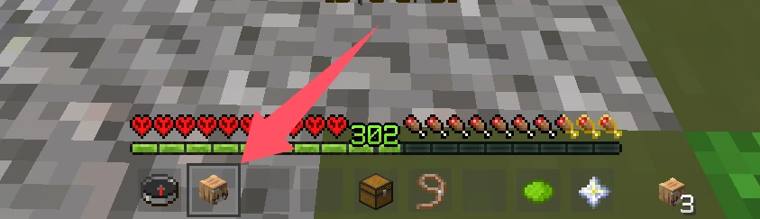

**找到铁砧**

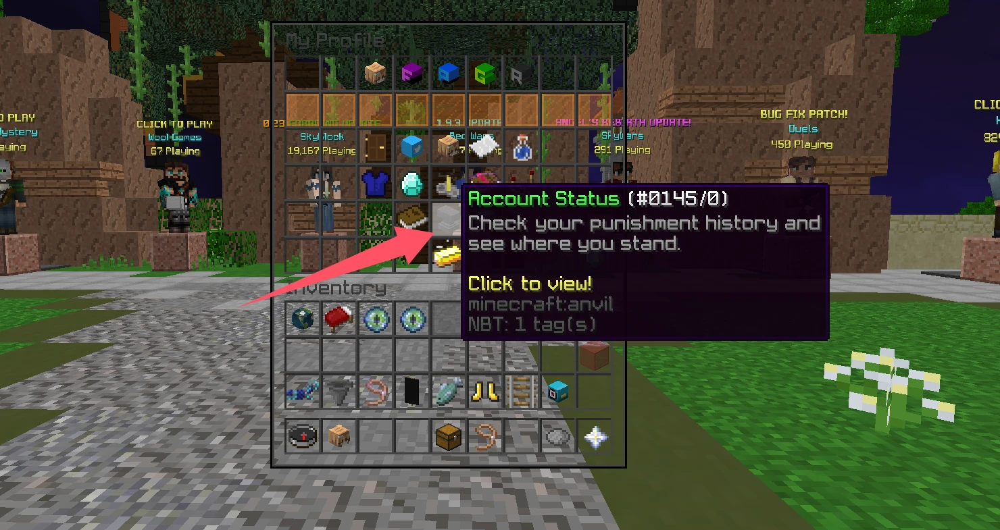

这里有关于账号的所有处罚记录，包括**竞技类游戏处罚**的信息也在这里可以看到

个人认为，除无Rank玩家与有Rank玩家在反作弊判定和处罚时长上可能存在差异外，VIP、MVP及MVP++等付费等级之间并无区别，也不存在所谓的‘深蓝++弱检测’机制。但YOUTUBE Rank用户确实享有反作弊豁免权限。

# 以下是有关封禁的内容：

*Skyblock的处罚内容在最后单独分类*

## ➤ 安全警报（俗称IPBan，但还是有一定区别的）

目前国内玩家首次进入Hypixel时如果使用加速器或加速IP一类的降低延迟的工具时通常会触发安全警报（如下图），这是因为这些加速器或加速IP的节点被某些人拿去在服务器内开挂并且被Ban之后会被服务器列入黑名单，当你和黑客使用同一个IP时便会触发安全警报。

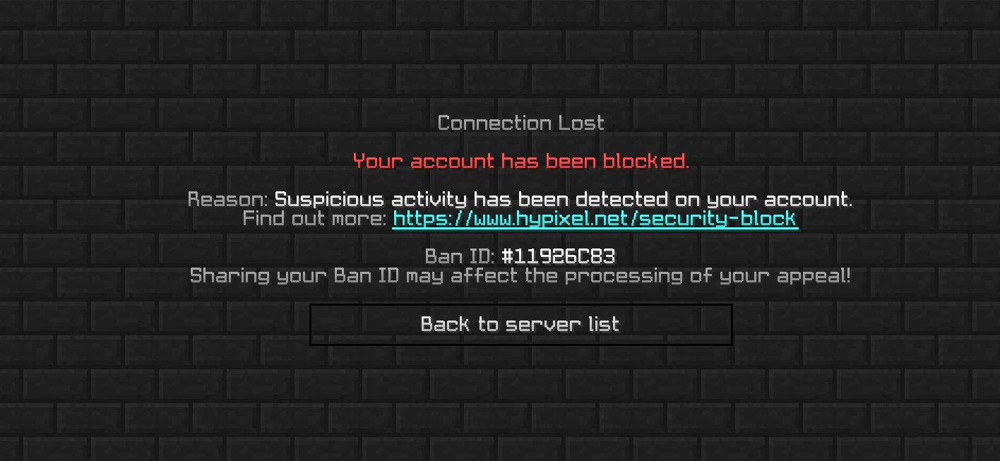

***社区内普遍认为大厅等级在21级及以后挂加速器游玩不会触发安全警报，实际这并不一定，我们目前认为这个是看你的Playtime（游玩时间），当游玩时间到达一定标准后便不触发安全警报，21+只是一个笼统的说法，如果想要快速升级，可以参考[链接](https://www.bilibili.com/video/BV1ZW421P7Uf)***

目前情况下，一般不会出现第二次自动检测安全警告，也就意味着在你因为加速器/加速IP被安全警告并申诉后，不会再因此被安全警告，但在特殊情况下也可能导致安全警报的二次触发：

<ul>
<li>打广告或者宣传外挂</li>
<li>频繁换加速器节点或加速IP</li>
<li><del>锦标赛在榜玩家查的严，可能换一次IP就会被安全警报Ban（锦标赛模式已删除）</del></li>
<li>管理员或者关系户大神看你不爽（不开玩笑这个真有）</li>
<li>如果你不对应以上常见情况，可能是WatchDog反作弊系统抽风，导致某些加速节点用户大规模封禁。这种情况下不要着急申诉，首先确定是否为加速节点大规模封禁，在这种情况下官方会自动撤销安全警报，如果申诉过快可能导致留下安全警报封禁记录。但也有没通过的案例（不知道是不是管理员脑子抽了，但是他后来发邮件给support解封了）</li>
<li>Admin认为给你充值的银行账户有风险</li>
</ul>

**安全警报的第三次封禁通常不会解封，即申诉未通过，这种情况下这个号基本上是不可能再进Hypixel了，即永久封禁**

## ➤ Cheating（作弊封禁）

使用黑名单内的mod进入服务器，或在服务器内使用作弊程序/mod被反作弊ban或者客服查岗之后就会触发此类封禁，如图：

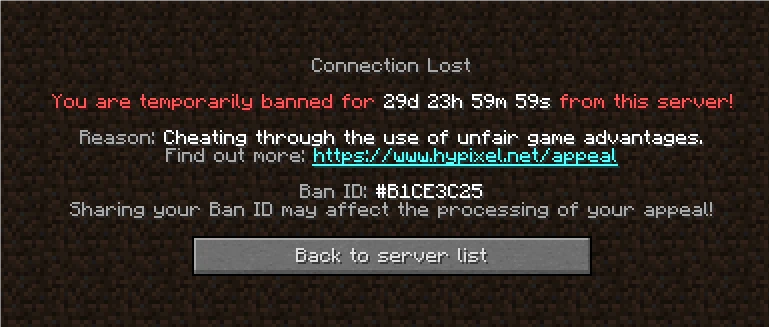

*关于作弊Ban主要解析其封禁时长，由于该ban涉及竞技类游戏禁令（稍后会提到），部分内容会在接下来的竞技类游戏封禁中给出*

1.如果你第一次因为作弊被抓包，你将获得30天大礼包，并且获得一个月的竞赛 Ban（即*竞技类游戏禁令*），注意在安全警报解除后的三个月内触发的第一次作弊ban将会是90天，禁赛ban时长不变

2.如果你第二次因为作弊被抓包，时长有以下几类：
在第一次解除后的3个月内，如果触发Cheating，第二次时长为360天
在第一次解除后的4-6个月内，如果触发Cheating，第二次时长为90/180天
在第一次解除后的6个月后，如果触发Cheating，第二次时长为30天
第二次作弊Ban竞技类游戏禁令时长为3个月

3.如果你第三次因为作弊被抓包，时长有以下几类：
在第二次解除后的5个月内，如果触发Cheating，第三次时长为360天
在第二次解除后的6-9个月内，如果触发Cheating，第三次时长为180天
在第二次解除后的9-12个月内，如果触发Cheating，第三次时长为90天
在第二次解除后的12个月零10天后，如果触发Cheating，第三次时长为30天
第三次及以后由于作弊Ban引起的竞技类游戏禁令时长为**一年**

**通俗而言：**
Ban level Low--->30天（绿色玻璃）
Ban level Medium --->90/180天（黄色玻璃）
Ban level High --->360天（红色玻璃）

## ➤ Boosting（坐挂车/Skyblock违规）

**一般社区：**

Boosting本源的阐述为“通过非公平手段，在游戏内获得账户数据增益，如坐挂车，队伍联合，非允许账号交易”

如果你的组队（仅指Party，随机匹配的不算）队友中有人开挂被查岗，有以下情况（通常是，不排除例外情况）：
1.如果作弊成员是队长，可能全队都会被Boosting，也可能全队都没事
2.如果作弊成员是队员，队长会被Boosting，其他人没事
3.双人组队通常为一人死号全队被ban（尤其是double模式）

如下图

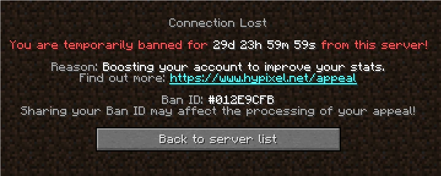

*关于Boosting主要解析其封禁时长，由于该ban涉及竞技类游戏禁令（稍后会提到），部分内容会在接下来的竞技类游戏封禁中给出*
1.如果你第一次因为Boosting被查岗，你将获得30天大礼包，并且获得一个月的竞赛Ban（即*技类游戏禁令*），注意在安全警报解除后的三次月内触发的第一次Boosting将会是90天，禁赛ban时长不变

2.如果你第二次因为Boosting被抓包，时长有以下几类：
在第一次解除后的3个月内，如果触发Boosting，第二次时长为360天
在第一次解除后的4-6个月内，如果触发Boosting，第二次时长为90/180天
在第一次解除后的6个月后，如果触发Boosting，第二次时长为30天
第二次作弊Ban竞技类游戏禁令时长为3个月

3.如果你第三次因为Boosting被抓包，时长有以下几类：
在第二次解除后的5个月内，如果触发Boosting，第三次时长为360天
在第二次解除后的6-9个月内，如果触发Boosting，第三次时长为180天
在第二次解除后的9-12个月内，如果触发Boosting，第三次时长为90天
在第二次Boosting解除后的12个月零10天后，如果触发Boosting，第三次时长为30天
第三次及以后由Boosting引起的竞技类游戏禁令时长为**一年**

**通俗而言：**
Ban level Low--->30天（绿色玻璃）
Ban level Medium --->90/180天（黄色玻璃）
Ban level High --->360天（红色玻璃）

**注意，Cheating和Boosting处罚通常是相通的，例如：你触发了一个月的Cheating封禁，在3个月内触发的Boosting也将会是360天**

**Boosting和Cheating的申诉几乎是**不可能通过**的，不要抱有幻想**

**被Cheating/Boosting ban后连胜记录和在榜数据会被**清除****

## Skyblock社区的Boosting：

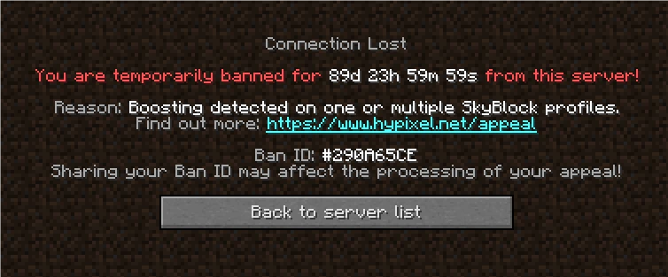

主要由于收c，Dupe物品，Macro等导致，通常会伴随Wipe，该类型主要有90天/360天，详细请参考最后一条

Skyblock Boosting记入封禁历史，不会触发竞技类游戏封禁

## ➤ 极端聊天违规行为

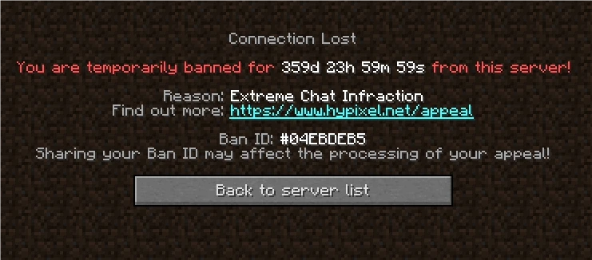

这个一般由于你的禁言黑历史太多导致的，但有时候发个IP也能爆，亦或者是发一些敏感词汇，*~~爆率相当高~~*，具体时长没有参考文献，这个一般是看管理员心情

## ➤ 违规ID

你的游戏ID因为涉及人身攻击，搞黄，打广告，冒充知名人物，与外挂名字相近（这个可能有）而导致被禁止进入服务器，这个等30天改名期到了把ID改了就能能进了，不需要申诉，不会记入**封禁历史**

## ➤ 违规建筑封禁

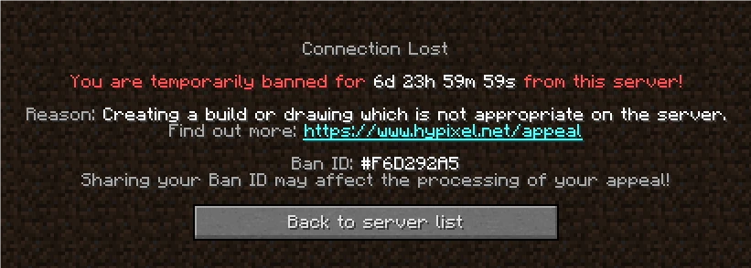

通常由于在建筑游戏，涂鸦游戏以及任何可建筑区域造“艺术品”导致，这个一般你不作死就不会死，在Ban Level为Low的情况下初次封禁为**7d**
:::warning 处罚情况
建筑Ban的时长机制同样遵循通用时长规则，视账号近期封禁情况而定
不会触发竞技类游戏封禁
:::

## ➤ 跨队联合（违规组队）

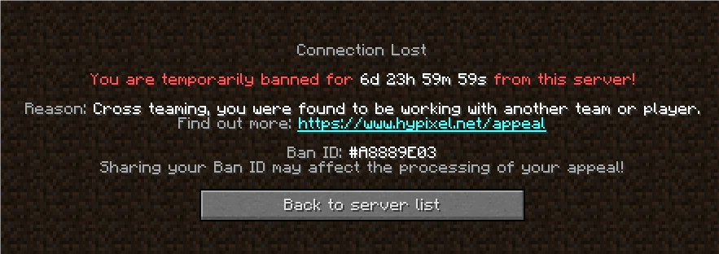

在Solo或者Team模式跟其他队成员跨队联合（这个一般查的没这么严，不刻意跨队联合就没事）

违规组队的封禁时长在3到30天不等，时长视账号具体情况而定

## ➤ 违规皮肤/披风

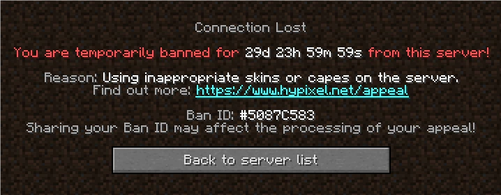

通常由于在皮肤/披风上搞颜色导致，~~这个说直白点纯纯活该~~

时长视账号具体情况而定

## ➤ 自己申请的删数据

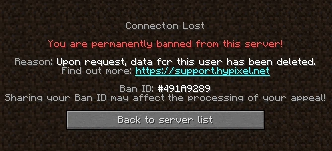

这个是自己申请的，不做过多解释，参考链接：https://hypixel.net/data-request

## ➤ 退款Ban

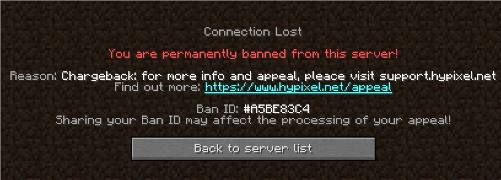

一般由于用黑刀（什么是黑刀我也不懂，自己查）充值，商店退款导致的

## ➤ 竞技类游戏禁令

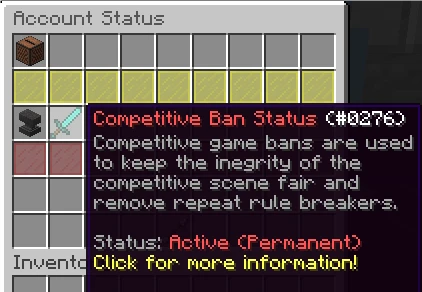

触发竞技类游戏禁令无法游玩~~Tournaments（已删除）~~, UHC Champions, Mega Walls, and The Pit，~~也不能用Ranked Skywars特效（在挑战更新后取消了）~~

Cheating和Boosting（不包括Skyblock Wipe）会触发竞技类游戏禁令

第一次的时长为1个月，会在Cheating/Boosting解封起开始计时，如果是在本月开始，将会在下个月解除，如果在本月中下旬将会在下下个月解除，例如5.1解除封禁，竞赛ban 6.1解除；在5.20解封，将会在7.1解除竞技类游戏禁令

第二次时长 3个月
第三次时长 12个月（于2024年6月取消永久）

## ➤ 有关Skyblock社区的处罚

1.账号普通封禁（ban）：一般由于玩家进行作弊，与常规hypixel封禁处罚相近。
注：在个人岛屿不允许使用一系列生电模组如投影，地毯，请不要安装。

2.技能进度清除（skill wipe）：一般由于玩家进行Macro行为，一般同时伴随账号封禁。
*Macro：指外在表现为在无人状态下进行自动游戏，包括自动挖矿，自动收田等，特别注意，通过挂机自动击杀goblin与Ice walker以及通过物理与软件手段挂机刷圆石，也被确认为Macro。*

3.存档进度删除（wipe）：一般由于存档内有玩家进行了boosting行为，包括Macro，非正常交易行为，多次作弊。由于coop存档涉及多人，一人受罚，全家白干，请仔细挑选coop。

::: note 社区数据
根据经验观察，一个存档中，同一个账号获得两次Cheating Ban通常就会wipe，但是如果这个档上有5个玩家，每个人都被Cheating ban过一次，档不会wipe，据此来看他是以记录单个账号处罚次数为依据
:::

**同时，当wipe出现时，主要涉及玩家会被账号封禁，其余玩家视情况可能会被发送安全警报而非封禁处罚，同时在wipe后下次登录时收到一本书告知wipe，如下：**

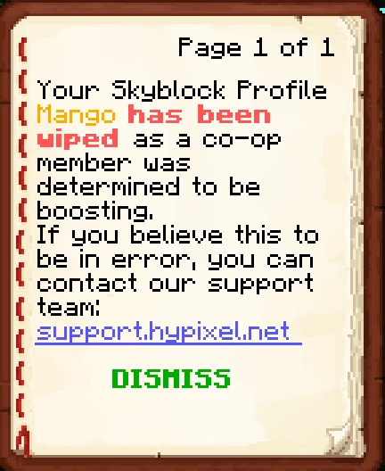

同时聊天框还会出现：

*批注：第2条已经很久没有实例，几乎都按照第3条处理*

————————————————————————————————————

**通常情况下以上情况不会发生，但是特殊情况下，可能会存在误判，且申诉难度极高，下面列举一些可能，以便于各位预防：**

1.收到了不明玩家的大额财物，可能这些物品来自于非正常交易，导致wipe，请不要随意收取不明财物。
2.在农业时过于走神/卡键盘上厕所，错过了管理员的查岗，导致被判定Macro。建议打开游戏声音，以方便检查异常，并保持注意力。

### 禁言处罚

#### ➤ 举报性禁言（非官方命名）

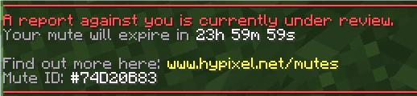

可能由于太多人举报或者触发了系统设定导致的，这个可能会被客服解，也可能会被升级为Minor或者Major违规

此禁言不可申诉且不计入违规历史（改判后计入）

#### ➤ 轻微违规（Minor）

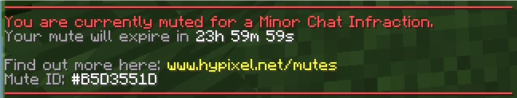

这个一般为1-3天不等，由于你的聊天中存在违规行为导致，详细请参考官方文献

此禁言记入违规历史，可申诉

#### ➤ 严重违规（Major）

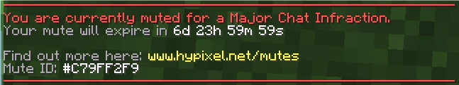

这个一般为7天起步，最高目前见过的能到90天，据说有1天，7天，15天，30天，90天这几个版本

严重了可能会跟聊天违规封禁挂钩

此禁言记入违规历史，可申诉

来自[青颓7cn](https://space.bilibili.com/454447483/) 的友情提示：关于mute这个，如果你要是发代购广告或者找车队什么的，别一直重复发，发了之后就发点别点，聊聊天什么的，把你上一条给顶掉，再发你要发的内容，亲测有效，有效规避hypixel的重复mute检测

**Tips：禁言期间可使用/immuted ID告诉别人你被禁言了**

### ➤ 常见问题答疑
---
**Q1：up主问一下如果是在18年一月被ban计算在以后ban吗？**
> A：官网上面关于禁赛的介绍是18年及以后的
**Q2：为啥我裸进也会被ban啊，还是30天大礼包**
> A：这是作弊处罚，一般情况下是被盗号了，或者说是使用了违规mod进服被反作弊直接ban了，这里提醒大家不要使用部分生电客户端进服有可能引发误判
**Q3：我想去申诉它又说您的关联帐户上没有有效的惩罚，请确认您链接的帐户正确无误**
> A：检查论坛账号绑定的MC账号是否为所需申诉的MC账号
**Q4：如果开G被封号，账号会不会被hyp给回档或者清档？**
> A：不会
**Q5：skyblock如果被wipe了 是只wipe犯事的Profile还是把一个号上所有的Profile全部wipe**
> A：犯事的档死掉，其他没事
**Q6：我前不久被误封后去hypixel论坛申诉，我把系统资源管理器后台所有程序进程和系统任务栏 游戏窗口标题栏完整的一秒内的封禁截图都上传了，官方还不承认是自己的反作弊问题导致我被误封**
> A：官方只会自动回复，不要抱有幻想
**Q7：它下面写着“请注意，如果该帐户出现其他安全警报，则可能会被网络永久禁止”这样还能开加速器吗**
> A：可以的，注意不要频繁换IP作死就行
**Q8：up，我想问问为了防止第二次被ban，我是不是应该尽量用正规付费加速器或者加速IP，加速器有什么推荐吗**
> A：这样做似乎没啥用，正常使用不要作死就行

**感谢[GloryPkqa](https://space.bilibili.com/1657868367) 的视频资料**
**感谢[Shang_gu](https://space.bilibili.com/647563518) Skyblock群组中的相关内容及审核/校对**
**感谢 Hypixel Ban服（mc.yzljc.top）提供的截图信息**
**参考文献：**
https://hypixel.net/threads/player-account-status-know-where-you-stand.4376642/